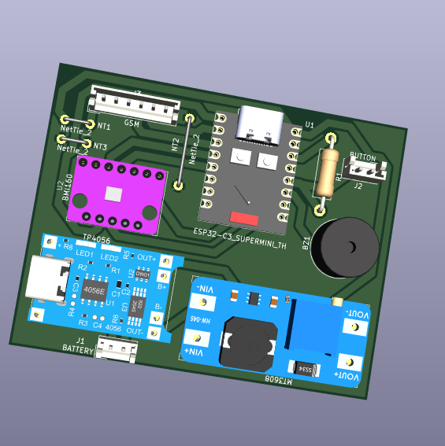
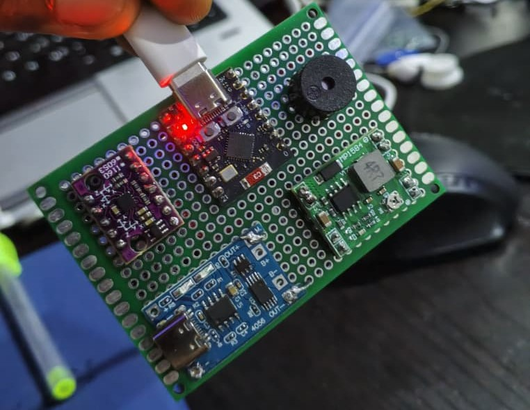
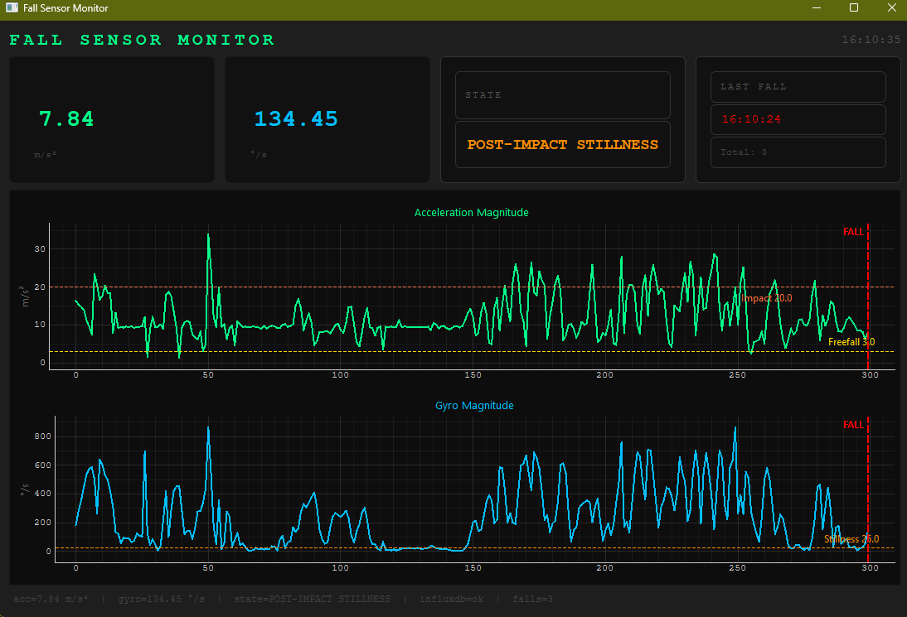

# Fall Sensor - ESP32-C3 Wearable Fall Detection System

## Overview

<p align="center">
  <br>
  <em>3D render of the Fall Sensor carrier PCB (v1, single-layer)</em>
</p>

An intelligent wearable fall detection system built on the ESP32-C3 Super Mini with BMI160 IMU, targeting elderly users with waist/lower-back placement. The system combines a 4-stage rule-based state machine with an on-device CNN (TFLite Micro, int8 QAT) for high-confidence detection. A persistent alerted state holds the alert active until the person's posture changes or they self-dismiss, preventing the common problem of fall alerts clearing while the person is still on the floor.

Real-time data streams over WiFi TCP to a PyQtGraph dashboard and InfluxDB/Grafana stack for threshold tuning and post-event analysis. A dual-purpose button handles both "I'm okay" dismissal and manual "I need help" alerts.

## Hardware

| Component | Part | Notes |
|---|---|---|
| MCU | ESP32-C3 Super Mini | USB-CDC, BLE, WiFi |
| IMU | BMI160 | I2C 0x68, ODR 200Hz |
| Charger | TP4056 | LiPo, 4.2V cutoff |
| Boost converter | MT3608 | Battery -> 5V rail |
| Buzzer | Passive buzzer | Active LOW driver |
| Button | Tactile switch | Dual-purpose: dismiss/SOS |
| Board | 5x7cm perfboard | Power/signal zone separated |

| Board | 5x7cm perfboard | Power/signal zone separated |

<p align="center">
  <br>
  <em>Hand-soldered perfboard build, ESP32-C3 Super Mini + BMI160</em>
</p>

**Pin assignments (ESP32-C3 Super Mini):**

| Pin | Function |
|---|---|
| GPIO8 | SDA (BMI160) |
| GPIO9 | SCL (BMI160) |
| GPIO2 | Buzzer |
| GPIO3 | Button (INPUT_PULLUP, active LOW) |
| GPIO4 | BMI160 INT1 (reserved) |
| GPIO5 | BMI160 INT2 (reserved) |

**Power path:** LiPo -> TP4056 (charge management) -> MT3608 (boost to 5V) -> ESP32-C3 5V pin -> onboard LDO -> 3.3V rail -> BMI160 VCC

## Project Structure

```
Fall_Sensor/
├── firmware_idf/                    # ESP-IDF project (active)
│   ├── CMakeLists.txt
│   ├── partitions.csv               # custom 3MB app partition for ESP32-C3 4MB flash
│   ├── sdkconfig.defaults
│   ├── main/
│   │   ├── CMakeLists.txt
│   │   ├── fall_sensor.cpp          # app_main() entry point
│   │   ├── main.cpp                 # state machine + BMI160 + tasks
│   │   ├── inference.cpp            # TFLite Micro wrapper + consecutive filter
│   │   ├── inference.h
│   │   ├── wifi_stream.cpp          # WiFi TCP server for dashboard streaming
│   │   ├── wifi_stream.h
│   │   └── fall_model.h             # auto-generated model C header
│   └── components/
│       ├── esp-tflite-micro/        # git submodule (espressif official)
│       ├── DFRobot_BMI160/          # git submodule (unmodified)
│       └── DFRobot_BMI160_wrapper/  # local CMakeLists.txt wrapper (tracked)
├── firmware/                        # legacy PlatformIO attempt - kept for reference
├── docs/
│   ├── ERRORS_AND_FIXES.md
│   └── ML_README.md
├── hardware/                        # KiCad schematics, BOM, perfboard layout
├── visualization/
│   ├── bridge.py                    # Serial to InfluxDB bridge
│   ├── dashboard.py                 # PyQtGraph dashboard (serial + WiFi TCP modes)
│   └── docker-compose.yml           # InfluxDB + Grafana stack
├── tests/
│   ├── three_classes/               # ML training pipeline
│   │   ├── inspect_dataset.py
│   │   ├── train_cnn.py
│   │   ├── train_qat.py
│   │   ├── quantize_model.py
│   │   ├── check_model.py
│   │   ├── convert_to_header.py
│   │   ├── list_ops.py
│   │   └── fall_cnn_qat_int8.tflite
│   └── edge_impulse_sample_v3/      # balanced SE-weighted sample (not tracked)
├── requirements.txt
├── .gitignore
└── README.md
```

## Cloning

This project uses git submodules. Clone with:

```bash
git clone --recurse-submodules <repo-url>
```

If already cloned:

```bash
git submodule update --init --recursive
```

## Building and Flashing

Open ESP-IDF terminal in VS Code (`Ctrl+Shift+P` -> ESP-IDF: Open ESP-IDF Terminal):

```bash
cd firmware_idf
idf.py set-target esp32c3
idf.py build
idf.py -p COM7 flash monitor
```

Exit monitor: `Ctrl+]`

On first build after a clean or target change, delete `sdkconfig` (not `sdkconfig.defaults`) before running `set-target` to avoid stale target conflicts.

## How It Works

### State Machine

```
STATE_NORMAL
  accelMag < 3.0 m/s²  ->  STATE_FREEFALL  (timeout 400ms)
  
STATE_FREEFALL
  accelMag > 20.0 m/s² ->  STATE_IMPACT    (window 500ms)
  
STATE_IMPACT
  gyroMag < 25 deg/s   ->  STATE_POST_IMPACT_STILLNESS
  
STATE_POST_IMPACT_STILLNESS
  stillness 2.5s + orientation change + NN confirms  ->  STATE_FALL_CONFIRMED
  
STATE_FALL_CONFIRMED
  captures fall orientation, triggers buzzer, fires FALL event
  ->  STATE_FALL_ALERTED  (persistent - does not auto-clear)
  
STATE_FALL_ALERTED
  re-buzzes every 10s
  posture change > 2.0 m/s² delta  ->  STATE_NORMAL
  button press ("I'm okay")        ->  STATE_NORMAL
```

Any state: button press outside STATE_FALL_ALERTED -> manual "I need help" alert

### ML Inference

- Model: lightweight 1D CNN, int8 QAT, 16.9KB flash, 47.1KB RAM
- Input: 512-sample sliding window of accel Y (in g) at 200Hz = 2.56 second window
- Consecutive filter: 3 consecutive runs >= 80% probability required before confirming
- Falls back to rule-based alone if window not yet full

### Sensor Configuration

BMI160 ODR set to 200Hz via direct register write after I2cInit():

```cpp
Wire.beginTransmission(0x68);
Wire.write(0x40); Wire.write(0x09);  // ACC_CONF: 200Hz
Wire.endTransmission();

Wire.beginTransmission(0x68);
Wire.write(0x42); Wire.write(0x09);  // GYR_CONF: 200Hz
Wire.endTransmission();
```

BMI160 init order matters: `softReset()` must be called before `I2cInit()`. Reversed order causes silent all-zero readings.

## Serial/WiFi Output Format

```
DATA,<timestamp_ms>,<accelMag>,<gyroMag>,<state>
FALL,<timestamp_ms>
```

State values: 0=NORMAL, 1=FREEFALL, 2=IMPACT, 3=POST-IMPACT STILLNESS, 4=FALL CONFIRMED, 5=FALL ALERTED

Output goes to both USB Serial (printf) and WiFi TCP simultaneously.

## Visualization

### Dashboard (PyQtGraph)

```bash
cd visualization
python dashboard.py
```

Switch between serial and WiFi at the top of the file:

```python
CONNECTION_MODE = "serial"   # or "wifi"
WIFI_HOST       = "192.168.x.x"   # ESP32-C3 IP printed on boot
WIFI_PORT       = 3333
```

The ESP32-C3 IP is printed on boot: `[WiFi] Connect dashboard with: TCP <IP>:3333`

<p align="center">
  <br>
  <em>Live dashboard showing a detected fall event: freefall, impact, then post-impact stillness</em>
</p>

### InfluxDB + Grafana

```bash
cd visualization
docker compose up -d
```

- InfluxDB: http://localhost:8086 (bucket: fallsensor, org: smartlab)
- Grafana: http://localhost:3000

## ML Pipeline

See [docs/ML_README.md](docs/ML_README.md) for full training and quantization details.

Quick retrain after any model or dataset change:

```bash
cd tests/three_classes
venv_compat\Scripts\activate    # Python 3.10 required - TF not yet on 3.13+
python train_qat.py
python convert_to_header.py     # outputs firmware_idf/main/fall_model.h
cd ../../firmware_idf
idf.py build
idf.py -p COM7 flash monitor
```

### Current Model Performance

| Metric | Value |
|---|---|
| Overall accuracy | 95.21% |
| Fall recall | 97.38% |
| ADL recall | 95.16% |
| Flash | 16.9 KB |
| Inference RAM | 47.1 KB |
| Window | 512 samples at 200Hz = 2.56s |

## Python Dependencies

```bash
pip install -r requirements.txt
```

ML training scripts require Python 3.10 in a separate venv (`venv_compat`) - TensorFlow does not support Python 3.13+.

## Future Work

- PCB design: 2-layer board, BMI160 and ESP32-C3 Super Mini as soldered modules on carrier, discrete power section
- Enclosure: TPU 3D printed, waist/belt-clip form factor
- BLE alert path for phone app connectivity
- SIM/GPS module on existing 5V rail for cellular fallback
- BMI160 INT1/INT2 for hardware step detection and low-power motion-wake
- Collect real elderly fall simulation data for model fine-tuning

## Troubleshooting

See [docs/ERRORS_AND_FIXES.md](docs/ERRORS_AND_FIXES.md)

## Author

Smart Ayodele
ayosmart129@gmail.com